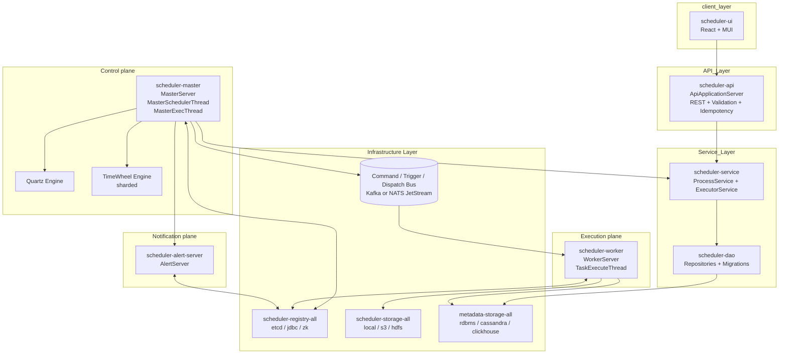
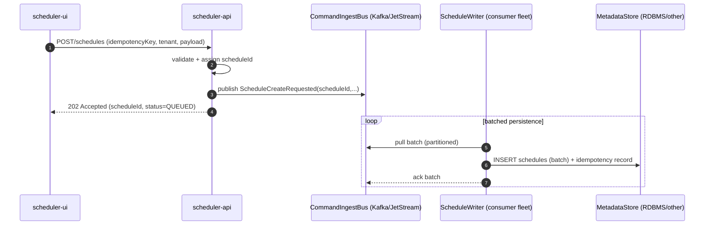
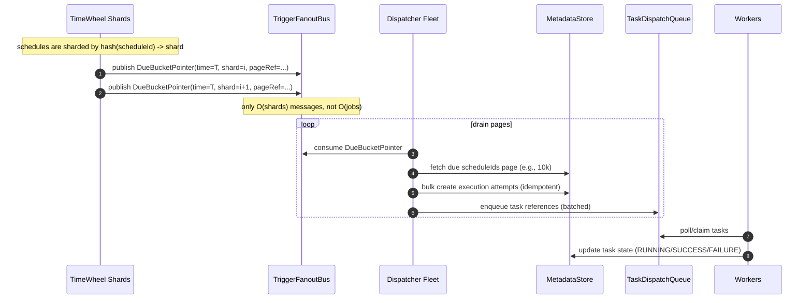

# Architecture

This document describes the target architecture and the core data/control flows.

## Component diagram

## Flow A — Schedule creation at 1M requests/sec (ingestion pipeline)

Key idea: **Do not synchronously write every create request to the metadata DB**.
Instead, treat the API as an ingestion gateway and persist via **batched writers**.

## Flow B — 10M jobs due at the same instant (bucket-pointer fanout)

Key idea: **Do not emit 10M trigger messages.**
Instead, timer shards emit **N pointer messages** (e.g., 4096) and dispatchers drain jobs in pages.

## Architectural invariants (non-negotiable)

- **DB is the source of truth**, but DB is not used as the high-rate queue for extreme scale.
- **At-least-once dispatch** with **idempotent attempt creation**.
- **Backpressure** is applied at ingestion, fanout, and dispatch layers.
- **Observability-first**: metrics/traces/logs must allow answering:
 - How late are triggers?
 - Where is queueing happening?
 - Which tenant is saturating capacity?
