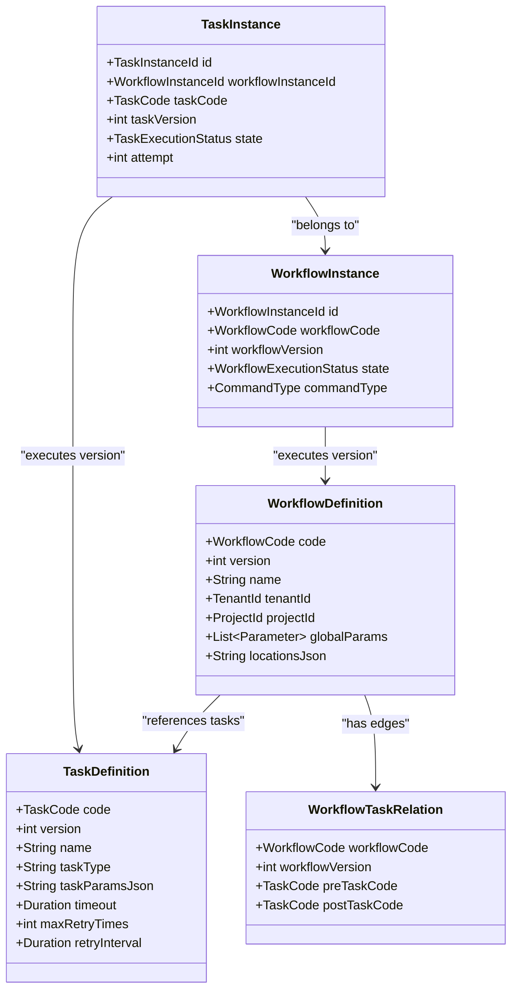
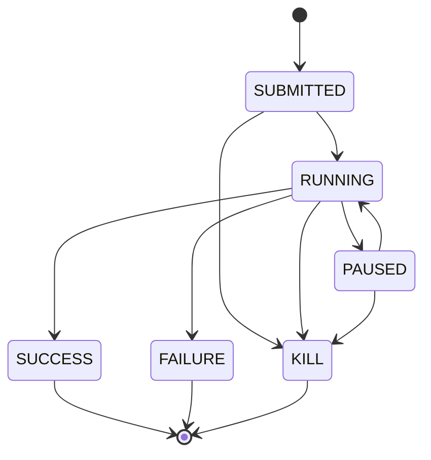
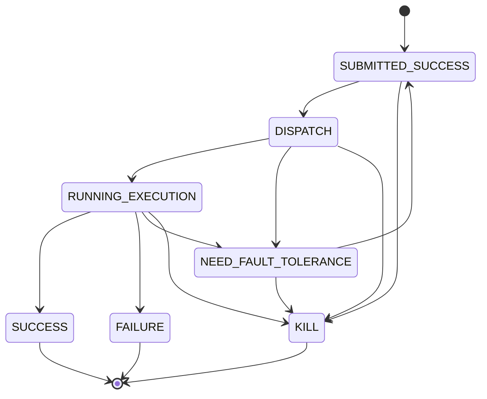

# Domain Model

This domain model enforces **Clean Architecture** boundaries:
- Domain code has **no** dependency on Spring, messaging libraries, registries, storage SDKs, etc.
- It defines the core scheduling concepts: **definitions vs instances**, **state machines**, and **DAG** planning structures.

## Definitions vs Instances

- **Definitions** are immutable templates, identified by `(code, version)`:
 - `WorkflowDefinition(code, version, ...)`
 - `TaskDefinition(code, version, ...)`
- **Instances** are runtime executions bound to a specific definition version:
 - `WorkflowInstance(id, workflowCode, workflowVersion, ...)`
 - `TaskInstance(id, workflowInstanceId, taskCode, taskVersion, ...)`

## Key entities (class diagram)

## Workflow state machine

## Task state machine

## DAG model

The domain includes a simple `Dag` structure:
- nodes: task codes (long)
- edges: dependency links (pre → post)
- provides `topologicalOrder()` with cycle detection

Cycle detection failure throws `DagCycleException`.
