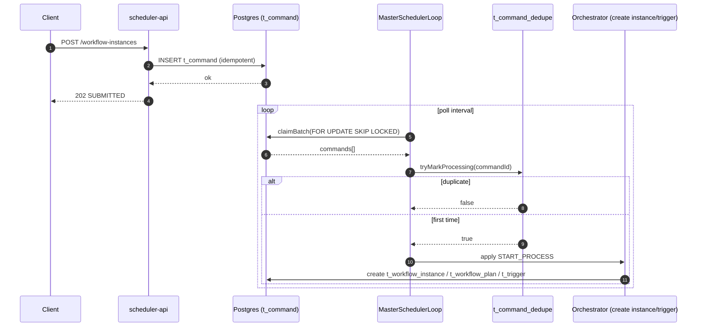

# Sequence — Low TPS Mode (DB-Poll Command Queue)

This project supports a low-TPS path where commands are written into Postgres and
the master polls and claims them.

```mermaid
sequenceDiagram
  autonumber

  participant C as Client
  participant API as scheduler-api
  participant DB as Postgres (t_command)
  participant MS as MasterSchedulerLoop
  participant DD as t_command_dedupe
  participant OR as Orchestrator (create instance/trigger)

  C->>API: POST /workflow-instances
  API->>DB: INSERT t_command (idempotent)
  DB-->>API: ok
  API-->>C: 202 SUBMITTED

  loop poll interval
    MS->>DB: claimBatch(FOR UPDATE SKIP LOCKED)
    DB-->>MS: commands[]
    MS->>DD: tryMarkProcessing(commandId)
    alt duplicate
      DD-->>MS: false
    else first time
      DD-->>MS: true
      MS->>OR: apply START_PROCESS
      OR->>DB: create t_workflow_instance / t_workflow_plan / t_trigger
    end
  end
```
