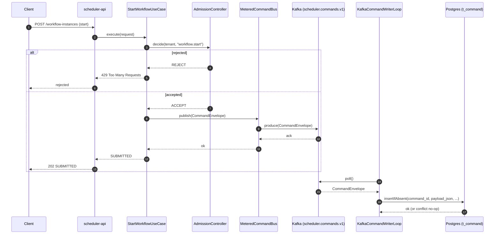

# Sequence Diagram — High TPS Ingestion (Kafka WAL + DB Command Writer)

This is the **ingestion path** when `SCHEDULER_INGESTION_MODE=KAFKA`.

- `scheduler-api` publishes `CommandEnvelope` to Kafka WAL topic `scheduler.commands.v1`.
- `KafkaCommandWriterLoop` (writer consumer group) persists the raw command to Postgres `t_command`
  via `insertIfAbsent` (idempotent).

