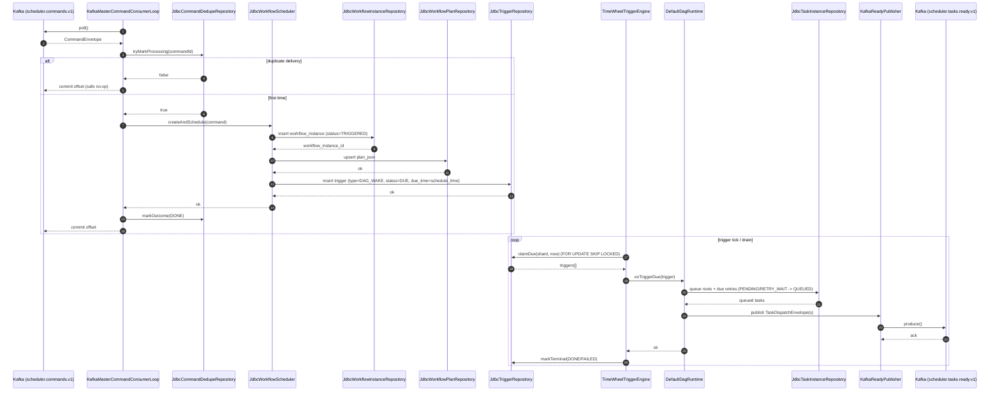

# Sequence Diagram — Master Consume → Materialize → Trigger → READY

This is the **master-side path** after a command is already in Kafka WAL (`scheduler.commands.v1`).

- **KafkaMasterCommandConsumerLoop** applies commands (leader/shard gated) and materializes:
  - `t_command_dedupe`
  - `t_workflow_instance`
  - `t_workflow_plan`
  - initial `t_trigger` (DAG wake)
- **TimeWheelTriggerEngine** claims due triggers (`FOR UPDATE SKIP LOCKED`) and calls DAG runtime.
- DAG runtime queues eligible tasks in DB and **publishes dispatch envelopes** to `scheduler.tasks.ready.v1`.

