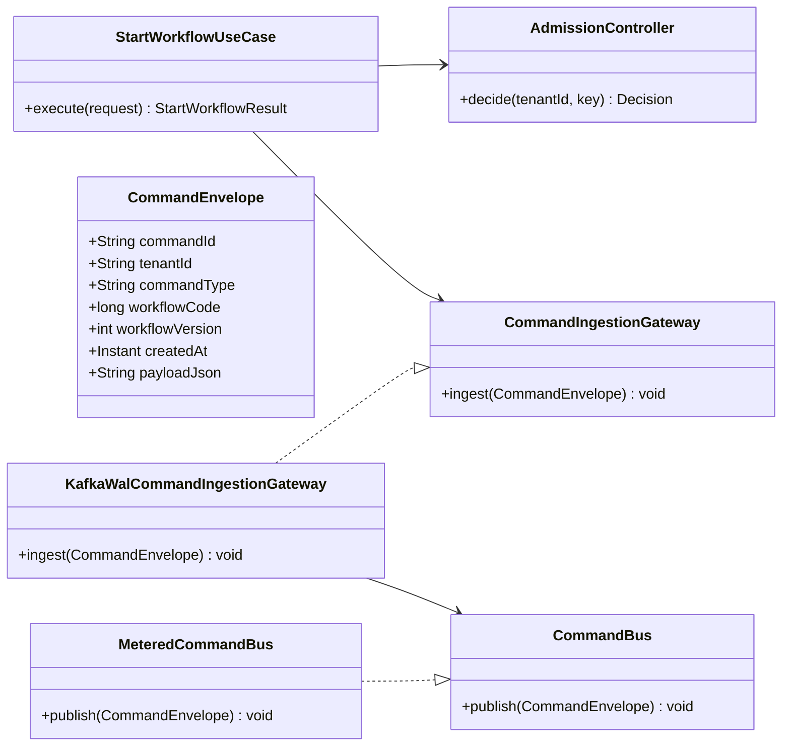

# Class Diagram — Ingestion Core (Use Case + Command Bus)

```mermaid
classDiagram
  direction LR

  class StartWorkflowUseCase {
    +execute(request) StartWorkflowResult
  }

  class AdmissionController {
    +decide(tenantId, key) Decision
  }

  class CommandEnvelope {
    +String commandId
    +String tenantId
    +String commandType
    +long workflowCode
    +int workflowVersion
    +Instant createdAt
    +String payloadJson
  }

  class CommandIngestionGateway {
    +ingest(CommandEnvelope) void
  }

  class KafkaWalCommandIngestionGateway {
    +ingest(CommandEnvelope) void
  }

  class CommandBus {
    +publish(CommandEnvelope) void
  }

  class MeteredCommandBus {
    +publish(CommandEnvelope) void
  }

  StartWorkflowUseCase --> AdmissionController
  StartWorkflowUseCase --> CommandIngestionGateway
  KafkaWalCommandIngestionGateway ..|> CommandIngestionGateway
  KafkaWalCommandIngestionGateway --> CommandBus
  MeteredCommandBus ..|> CommandBus
```
