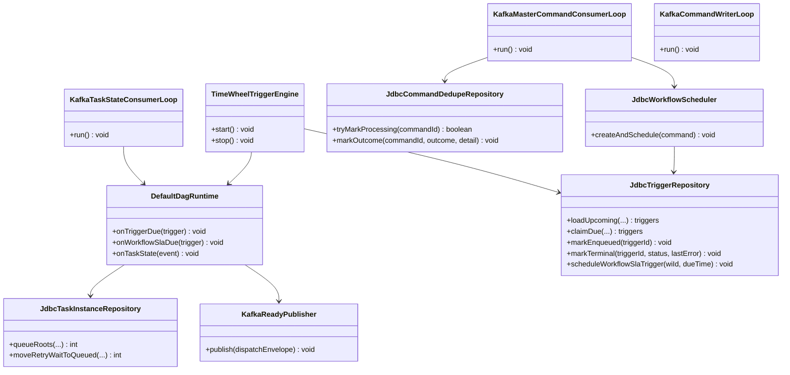

# Class Diagram — Master Runtime (Consumers, Trigger Engine, DAG Runtime)

This diagram shows the **scheduler-master** runtime pieces that execute the orchestration path.

Notes:
- Commands are consumed from Kafka WAL (`scheduler.commands.v1`).
- Triggers are stored in Postgres (`t_trigger`) and claimed with `SKIP LOCKED`.
- Ready tasks are published to Kafka (`scheduler.tasks.ready.v1`).
- Task state events are consumed from Kafka (`scheduler.task.state.v1`) to progress the DAG.

