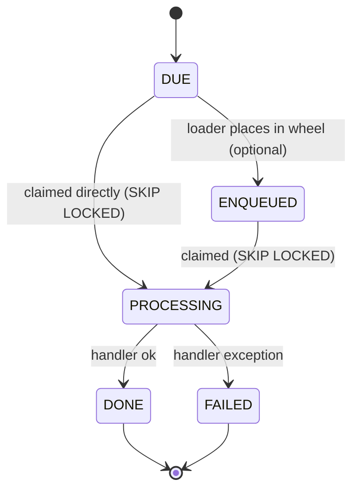

# State Diagram — Trigger Lifecycle (`t_trigger.status`)

Triggers are **DB-owned** scheduling primitives. The master claims them with
`FOR UPDATE SKIP LOCKED` and executes the corresponding wakeup.

Key behaviors:
- Triggers are inserted as `DUE`.
- Loader may mark upcoming triggers `ENQUEUED` when placed into the in-memory wheel.
- Claimer marks triggers `PROCESSING`.
- Trigger is terminal as `DONE` or `FAILED` (with `last_error`).

