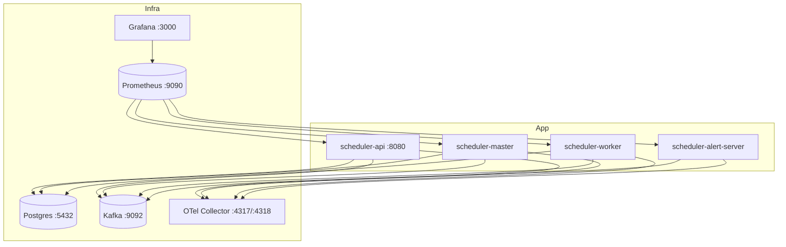

# Deployment Topology — Local Docker Demo

```mermaid
flowchart TB
  subgraph App
    API[scheduler-api :8080]
    M[scheduler-master]
    W[scheduler-worker]
    AS[scheduler-alert-server]
  end

  subgraph Infra
    PG[(Postgres :5432)]
    K[(Kafka :9092)]
    OT[OTel Collector :4317/:4318]
    PR[(Prometheus :9090)]
    G[Grafana :3000]
  end

  API --> PG
  M --> PG
  W --> PG

  API --> K
  M --> K
  W --> K
  AS --> K

  API --> OT
  M --> OT
  W --> OT
  AS --> OT

  PR --> API
  PR --> M
  PR --> W
  PR --> AS
  G --> PR
```
