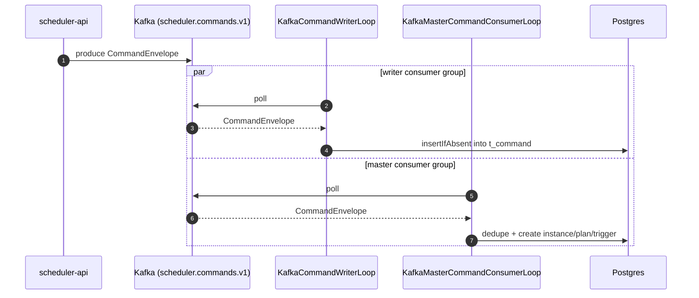

# Sequence — Writer Role vs Master Role

Writer group persists raw commands to DB (`t_command`).
Master group applies commands (dedupe + materialize instance/plan/trigger).

```mermaid
sequenceDiagram
  autonumber

  participant API as scheduler-api
  participant K as Kafka (scheduler.commands.v1)
  participant WR as KafkaCommandWriterLoop
  participant MC as KafkaMasterCommandConsumerLoop
  participant DB as Postgres

  API->>K: produce CommandEnvelope

  par writer consumer group
    WR->>K: poll
    K-->>WR: CommandEnvelope
    WR->>DB: insertIfAbsent into t_command
  and master consumer group
    MC->>K: poll
    K-->>MC: CommandEnvelope
    MC->>DB: dedupe + create instance/plan/trigger
  end
```
