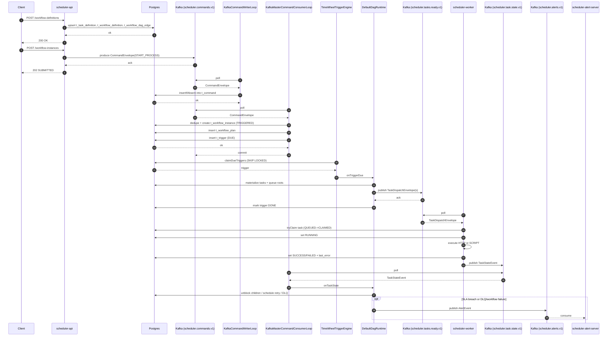

# Sequence Diagram — End-to-End (Define → Start → Run → Complete)

```mermaid
sequenceDiagram
  autonumber

  participant C as Client
  participant API as scheduler-api
  participant DB as Postgres
  participant K1 as Kafka (scheduler.commands.v1)
  participant WRT as KafkaCommandWriterLoop
  participant MC as KafkaMasterCommandConsumerLoop
  participant TR as TimeWheelTriggerEngine
  participant DR as DefaultDagRuntime
  participant K2 as Kafka (scheduler.tasks.ready.v1)
  participant WK as scheduler-worker
  participant K3 as Kafka (scheduler.task.state.v1)
  participant AL as Kafka (scheduler.alerts.v1)
  participant AS as scheduler-alert-server

  %% Define
  C->>API: POST /workflow-definitions
  API->>DB: upsert t_task_definition, t_workflow_definition, t_workflow_dag_edge
  DB-->>API: ok
  API-->>C: 200 OK

  %% Start workflow (WAL)
  C->>API: POST /workflow-instances
  API->>K1: produce CommandEnvelope(START_PROCESS)
  K1-->>API: ack
  API-->>C: 202 SUBMITTED

  %% WAL copy to DB
  WRT->>K1: poll
  K1-->>WRT: CommandEnvelope
  WRT->>DB: insertIfAbsent into t_command
  DB-->>WRT: ok

  %% Master materialization
  MC->>K1: poll
  K1-->>MC: CommandEnvelope
  MC->>DB: dedupe + create t_workflow_instance (TRIGGERED)
  MC->>DB: insert t_workflow_plan
  MC->>DB: insert t_trigger (DUE)
  DB-->>MC: ok
  MC-->>K1: commit

  %% Trigger wake / DAG
  TR->>DB: claimDueTriggers (SKIP LOCKED)
  DB-->>TR: trigger
  TR->>DR: onTriggerDue
  DR->>DB: materialize tasks + queue roots
  DR->>K2: publish TaskDispatchEnvelope(s)
  K2-->>DR: ack
  DR->>DB: mark trigger DONE

  %% Worker execution
  WK->>K2: poll
  K2-->>WK: TaskDispatchEnvelope
  WK->>DB: tryClaim task (QUEUED->CLAIMED)
  WK->>DB: set RUNNING
  WK->>WK: execute HTTP or SCRIPT
  WK->>DB: set SUCCESS/FAILED + last_error
  WK->>K3: publish TaskStateEvent

  %% Master progress / retry / alerts
  MC->>K3: poll
  K3-->>MC: TaskStateEvent
  MC->>DR: onTaskState
  DR->>DB: unblock children / schedule retry / DLQ
  opt SLA breach or DLQ/workflow failure
    DR->>AL: publish AlertEvent
    AL-->>AS: consume
  end
```
