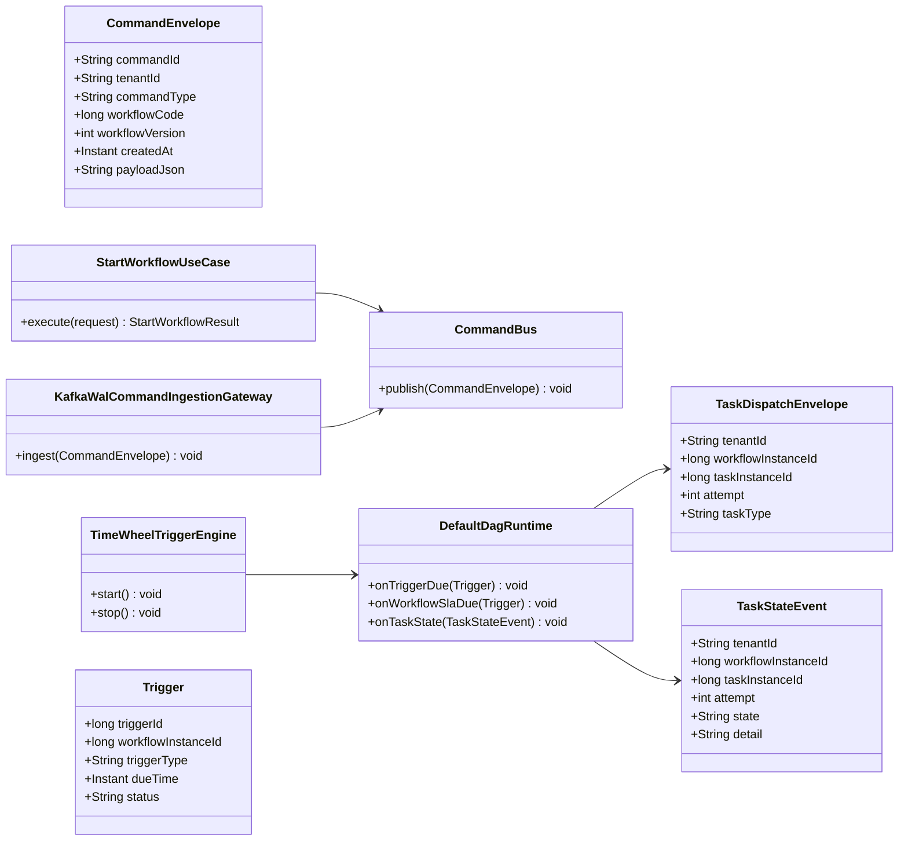

# Class Diagram — Core Types (Commands, Triggers, Tasks)

```mermaid
classDiagram
  direction LR

  class CommandEnvelope {
    +String commandId
    +String tenantId
    +String commandType
    +long workflowCode
    +int workflowVersion
    +Instant createdAt
    +String payloadJson
  }

  class StartWorkflowUseCase {
    +execute(request) StartWorkflowResult
  }

  class CommandBus {
    +publish(CommandEnvelope) void
  }

  class KafkaWalCommandIngestionGateway {
    +ingest(CommandEnvelope) void
  }

  class TimeWheelTriggerEngine {
    +start() void
    +stop() void
  }

  class Trigger {
    +long triggerId
    +long workflowInstanceId
    +String triggerType
    +Instant dueTime
    +String status
  }

  class DefaultDagRuntime {
    +onTriggerDue(Trigger) void
    +onWorkflowSlaDue(Trigger) void
    +onTaskState(TaskStateEvent) void
  }

  class TaskDispatchEnvelope {
    +String tenantId
    +long workflowInstanceId
    +long taskInstanceId
    +int attempt
    +String taskType
  }

  class TaskStateEvent {
    +String tenantId
    +long workflowInstanceId
    +long taskInstanceId
    +int attempt
    +String state
    +String detail
  }

  StartWorkflowUseCase --> CommandBus
  KafkaWalCommandIngestionGateway --> CommandBus
  TimeWheelTriggerEngine --> DefaultDagRuntime
  DefaultDagRuntime --> TaskDispatchEnvelope
  DefaultDagRuntime --> TaskStateEvent
```
