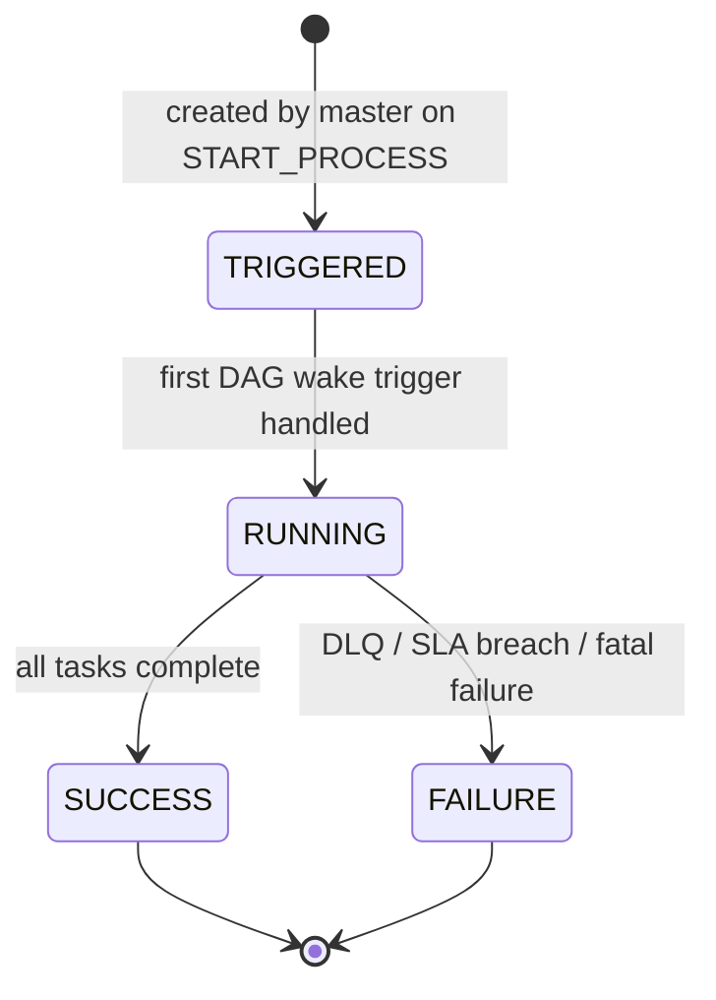

# State Diagram — Workflow Instance Lifecycle (`t_workflow_instance.status`)

```mermaid
stateDiagram-v2
  [*] --> TRIGGERED: created by master on START_PROCESS
  TRIGGERED --> RUNNING: first DAG wake trigger handled
  RUNNING --> SUCCESS: all tasks complete
  RUNNING --> FAILURE: DLQ / SLA breach / fatal failure
  SUCCESS --> [*]
  FAILURE --> [*]
```
