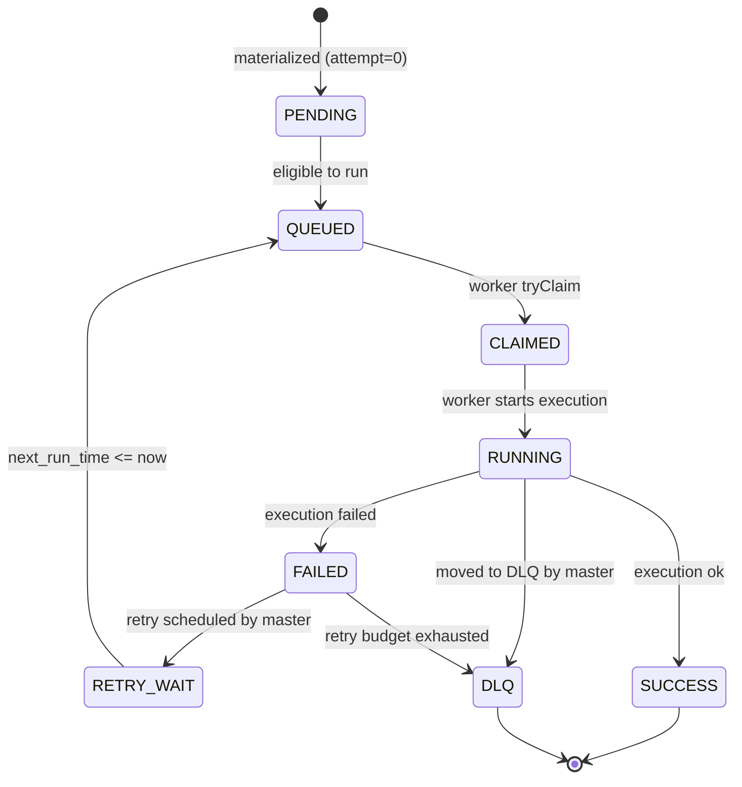

# State Diagram — Task Instance Lifecycle (`t_task_instance.status`)

```mermaid
stateDiagram-v2
  [*] --> PENDING: materialized (attempt=0)
  PENDING --> QUEUED: eligible to run
  RETRY_WAIT --> QUEUED: next_run_time <= now

  QUEUED --> CLAIMED: worker tryClaim
  CLAIMED --> RUNNING: worker starts execution

  RUNNING --> SUCCESS: execution ok
  RUNNING --> FAILED: execution failed
  RUNNING --> DLQ: moved to DLQ by master

  FAILED --> RETRY_WAIT: retry scheduled by master
  FAILED --> DLQ: retry budget exhausted

  SUCCESS --> [*]
  DLQ --> [*]
```
