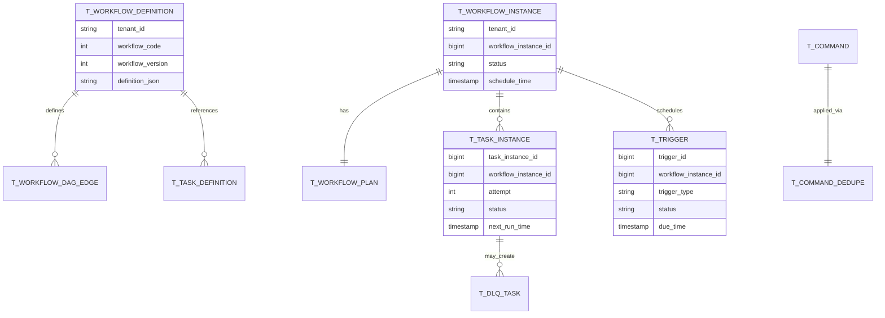

# ER Diagram — Persistence (High-Level)

This is intentionally **high-level** (demo-friendly) and reflects the current schema roles.

```mermaid
erDiagram
  T_WORKFLOW_DEFINITION ||--o{ T_WORKFLOW_DAG_EDGE : defines
  T_WORKFLOW_DEFINITION ||--o{ T_TASK_DEFINITION : references

  T_WORKFLOW_INSTANCE ||--|| T_WORKFLOW_PLAN : has
  T_WORKFLOW_INSTANCE ||--o{ T_TASK_INSTANCE : contains
  T_WORKFLOW_INSTANCE ||--o{ T_TRIGGER : schedules

  T_TASK_INSTANCE ||--o{ T_DLQ_TASK : may_create

  T_COMMAND ||--|| T_COMMAND_DEDUPE : applied_via

  T_WORKFLOW_DEFINITION {
    string tenant_id
    int workflow_code
    int workflow_version
    string definition_json
  }
  T_WORKFLOW_INSTANCE {
    string tenant_id
    bigint workflow_instance_id
    string status
    timestamp schedule_time
  }
  T_TASK_INSTANCE {
    bigint task_instance_id
    bigint workflow_instance_id
    int attempt
    string status
    timestamp next_run_time
  }
  T_TRIGGER {
    bigint trigger_id
    bigint workflow_instance_id
    string trigger_type
    string status
    timestamp due_time
  }
```
